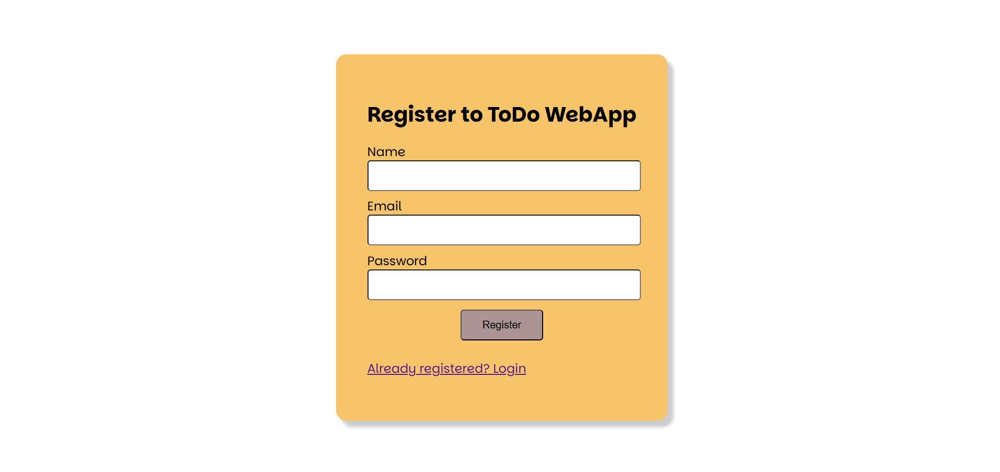

# Todo

A fully functional ToDo web application build with React + Typescript frontend and Node.js + Express + MongoDB backend. The project focuses on clean UI, developed without any CSS frameworks and fully custom styling from scratch.  
The project has been deployed and you can checkout on following link:  
[link to the project](https://todo-sand-five.vercel.app/)

# Features

a. User authentication  
User registration with unique email, name and password with secure login.  
b. Differentiating task with categories  
Users can create categories to organize task  
c. Task management  
User can add task with title, description, deadline and priority. Tasks can be edited or mark as complete  

# Frontend

React with Typescript  
CSS  

# Backend

Node.js with Express  
MongoDB for database management  

# Deployment

Frontend: Vercel  
Backend: Render  

# Installation

Prerequisites  

- Node.js and npm installed  
- MongoDB database connection string  

Clone the repository  
git clone "https://github.com/amritchapai/Todo"  
cd Todo  
  
Backend Setup  
a.navigate to backend  
cd backend  
b. install dependencies  
npm install  
c. add .env file with following variables  
PORT = preferred port number  
MONGOURI = your Mongo_db connection string  
SALTROUNDS = saltrounds for hashing  
SECRETKEY = your-secret-key for jwt signing  
d. start backend server  
    npm run dev  
  
# Frontend Setup
  
a. Navigate to frontend  
cd frontend  
b. Run development server  
npm run dev  
  
# Usage
  
a. Register a new account by providing your name, email and password  
b. login with the registered email and password.  
c. Create a category to organize your tasks.  
d. Add tasks with titles, descriptions, deadline, and priorities.  
e. Edit tasks or mark them as completed anytime.  
  
# Screenshots
  
  
  
  
  
  
  
  
  
# License
  
This project is licensed under the [MIT license](https://opensource.org/license/mit).  
  
Feel free to modify or adjust the content to suit your preferences.  
